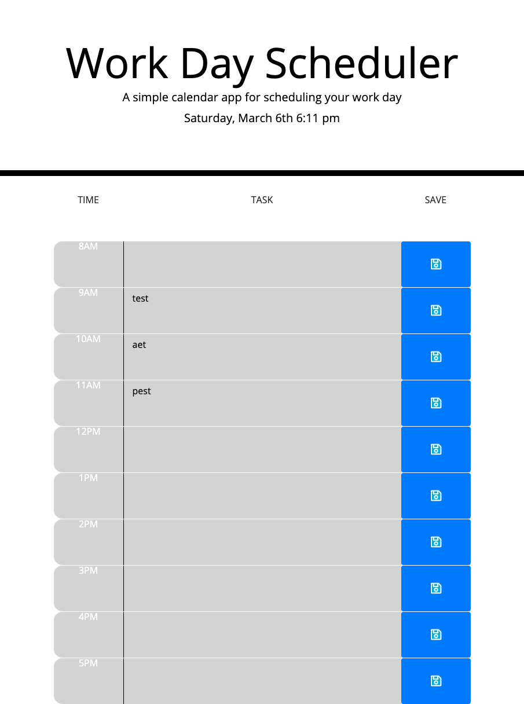

# workday-scheduler

## What is the project?

This project is a workday scheduler. A user can see the current date and time, enter tasks and save them for future use and can see whether a task is in the past, present or future.

## What were the challenges?

My biggest challenge was traversing the DOM to go from the save button to the textarea to save it to local storage. 

## Why did I decide to do this project?

This project was really interesting to develop. It is a very practical application as I constantly use my calendar to keep track of appointments and meetings. It was also really beneficial to explore the moment() library and how to best utilize it.

## What I learned in the process?

I learned a lot more about computer logic and flow of code. I learned more about the moment() library and DOM traversing.

## What makes this project stand out?

This project is a great example of simple yet very effective workday scheduler.

## Project Screenshot  

 
## Link to Deployed Project  

https://stevenstefanov.github.io/workday-scheduler/

## Instalation

No instalation required on this project. Simply run as a normal website.

## Usage

This is a single page website. Upon start, user is presented with the current date and time on top and a daily planner with the hours of 8am - 5pm. The user can enter text in the middle fields and press the save button. Upon pressing the save button, any text entered in the corresponding text field on the same row gets saved to the local storage. If a field is colored in gray, the events are in the past; if the field is red, it is the present, and if it is green, it is in the future.

## Credits

Thank you to Columbia's Full-Stack Web Developer bootcamp for all the assistance and for teaching me all that I have learned. Credit also goes to Google for helping me find any needed resource.

## Licence

Copyright (c) 2021 Steven Stefanov

Permission is hereby granted, free of charge, to any person obtaining a copy
of this software and associated documentation files (the "Software"), to deal
in the Software without restriction, including without limitation the rights
to use, copy, modify, merge, publish, distribute, sublicense, and/or sell
copies of the Software, and to permit persons to whom the Software is
furnished to do so, subject to the following conditions:

The above copyright notice and this permission notice shall be included in all
copies or substantial portions of the Software.

THE SOFTWARE IS PROVIDED "AS IS", WITHOUT WARRANTY OF ANY KIND, EXPRESS OR
IMPLIED, INCLUDING BUT NOT LIMITED TO THE WARRANTIES OF MERCHANTABILITY,
FITNESS FOR A PARTICULAR PURPOSE AND NONINFRINGEMENT. IN NO EVENT SHALL THE
AUTHORS OR COPYRIGHT HOLDERS BE LIABLE FOR ANY CLAIM, DAMAGES OR OTHER
LIABILITY, WHETHER IN AN ACTION OF CONTRACT, TORT OR OTHERWISE, ARISING FROM,
OUT OF OR IN CONNECTION WITH THE SOFTWARE OR THE USE OR OTHER DEALINGS IN THE
SOFTWARE.