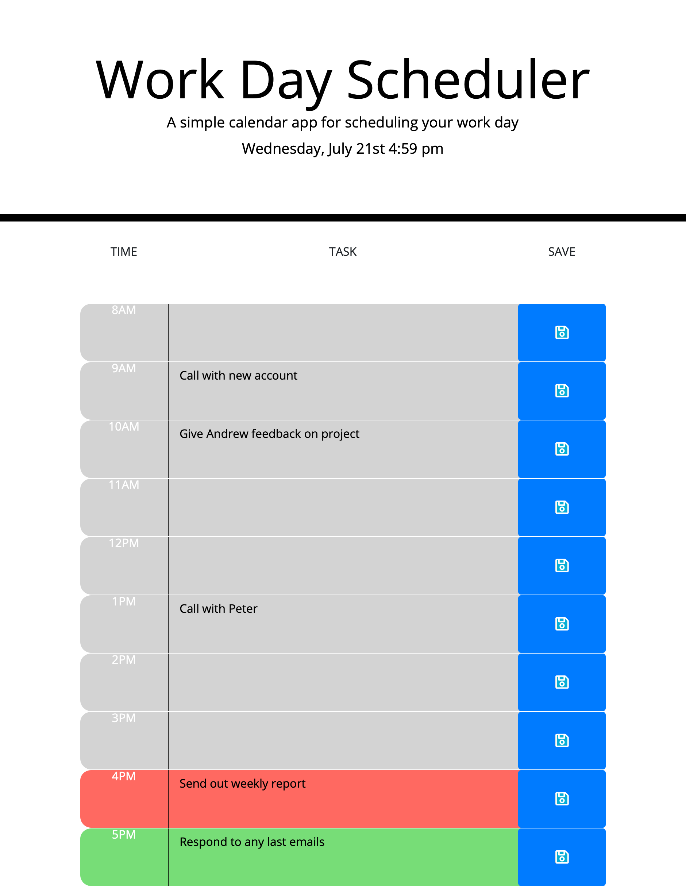

# Workday Scheduler

## Project Description

This project is a note taker with which a user can see the current date and time, enter tasks for certain hours of the workday and save them for future use. The user can also see whether a task is in the past, present or future.

## Project Screenshot  

 
## Link to Deployed Project  

https://stevenstefanov.github.io/workday-scheduler/

## What were the challenges?

My biggest challenge was traversing the DOM to go from the save button to the textarea to save the input text to local storage. This was also one of my first times working with Bootstrap, so I was somewhat unfamiliar with it's classes. However, after reading some of the documentation, it was pretty easy to use.

## Why did I decide to do this project?

This project was really interesting to develop. It is a very practical application as I constantly use my calendar to keep track of appointments and meetings in my personal and professional life. It was also really beneficial to explore the `moment()` library and how to best utilize it.

## What I learned in the process?

I learned a lot more about computer logic and flow of code. I learned how to traverse the DOM using the `.parent()` and `.sibling()` methods and I familiarized myself more with the `moment()` library.

## What makes this project stand out?

This project is a clean and really easy to use scheduler. It has a built-in time keeper, it identifies what hour of the day it is, and works very fast.

## Usage

This is a single page website. Upon start, the user is presented with the current date and time on top of the screen and a daily planner with the hours of 8am - 5pm. The user can enter text in the middle fields and press the save button. Upon pressing it, any text entered in the corresponding text field gets saved to the local storage of the machine. If a field is colored in gray, the events are in the past; if the field is red, it is in the present, and if it is green, it is in the future.

## Credits

Thank you to Columbia's Full-Stack Web Developer bootcamp for all the assistance and for teaching me all that I have learned.

## Licence

Copyright (c) 2021 Steven Stefanov

Permission is hereby granted, free of charge, to any person obtaining a copy
of this software and associated documentation files (the "Software"), to deal
in the Software without restriction, including without limitation the rights
to use, copy, modify, merge, publish, distribute, sublicense, and/or sell
copies of the Software, and to permit persons to whom the Software is
furnished to do so, subject to the following conditions:

The above copyright notice and this permission notice shall be included in all
copies or substantial portions of the Software.

THE SOFTWARE IS PROVIDED "AS IS", WITHOUT WARRANTY OF ANY KIND, EXPRESS OR
IMPLIED, INCLUDING BUT NOT LIMITED TO THE WARRANTIES OF MERCHANTABILITY,
FITNESS FOR A PARTICULAR PURPOSE AND NONINFRINGEMENT. IN NO EVENT SHALL THE
AUTHORS OR COPYRIGHT HOLDERS BE LIABLE FOR ANY CLAIM, DAMAGES OR OTHER
LIABILITY, WHETHER IN AN ACTION OF CONTRACT, TORT OR OTHERWISE, ARISING FROM,
OUT OF OR IN CONNECTION WITH THE SOFTWARE OR THE USE OR OTHER DEALINGS IN THE
SOFTWARE.